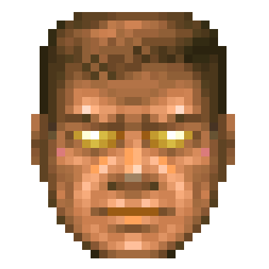

<!--  -->
<a href="https://github.com/levyto" style="color: black;"> 
    <i class="fa fa-github fa-4x" title="GitHub" style="float: right;"></i> 
</a>
<!-- <i class="fa fa-linux fa-4x"></i> -->

**Ph.D. student**: KME&thinsp;/&thinsp;FAV&thinsp;/&thinsp;ZČU

**Místnost**: &nbsp;&emsp;&emsp;UC 425 (Technická 8, Plzeň)

**E-mail**:  &emsp;&emsp;&emsp; [levyto@kme.zcu.cz](mailto:levyto@kme.zcu.cz)

Lorem ipsum dolor sit amet, consectetur adipiscing elit. Morbi tempus ante sit amet enim tincidunt finibus et sed nisi. Morbi ullamcorper ligula ac ullamcorper aliquam. Sed mi orci, tincidunt vitae augue quis, feugiat convallis nulla. Nam luctus nisl purus, in bibendum massa iaculis et. Suspendisse ut velit semper, commodo nunc malesuada, dignissim augue. Nunc at laoreet eros, sagittis gravida massa. Nulla gravida lacus odio, at congue felis sagittis sit amet. In porttitor lacinia dolor et lobortis. Aliquam eu sodales risus. Praesent iaculis eros id felis bibendum, sit amet posuere est dictum.

Vestibulum congue faucibus ipsum, in imperdiet lectus suscipit et. Ut efficitur turpis in est lobortis congue. Nullam nisi lectus, tempus ac arcu in, efficitur ultricies urna. Proin in ;risus enim. Vestibulum mattis erat nulla, efficitur auctor odio tincidunt in. Nullam bibendum augue vel euismod sollicitudin. Nulla pretium non nisi eget consequat. Nam pharetra est vitae lorem posuere, id varius arcu ornare. Sed at felis turpis. Maecenas id justo pretium sem porta faucibus. Donec quis molestie sapien. Fusce sit amet erat velit.

<!-- Jenom tak klidně levitují ve vzduchu. Jelikož slunce jasně září a na obloze byste od východu k západu hledali mráček marně, balónky působí jako jakási fata morgána uprostřed pouště. Zkrátka široko daleko nikde nic, jen zelenkavá tráva, jasně modrá obloha a tři křiklavě barevné pouťové balónky, které se téměř nepozorovatelně pohupují ani ne moc vysoko, ani moc nízko nad zemí. Kdyby pod balónky nebyla sytě zelenkavá tráva, ale třeba suchá silnice či beton, možná by bylo vidět jejich barevné stíny - to jak přes poloprůsvitné barevné balónky prochází ostré sluneční paprsky. Jenže kvůli všudy přítomné trávě jsou stíny balónků sotva vidět, natož aby šlo rozeznat, jakou barvu tyto stíny mají. Uvidět tak balónky náhodný kolemjdoucí, jistě by si pomyslel, že už tu takhle poletují snad tisíc let. Stále si víceméně drží výšku a ani do stran se příliš nepohybují. Proti slunci to vypadá, že se slunce pohybuje k západu rychleji než balónky, a možná to tak skutečně je. Nejeden filozof by mohl tvrdit, že balónky se sluncem závodí, ale fyzikové by to jistě vyvrátili. Z fyzikálního pohledu totiž balónky působí zcela nezajímavě. Nejvíc bezpochyby zaujmou děti - jedna malá holčička zrovna včera div nebrečela, že by snad balónky mohly prasknout. A co teprve ta stuha.

Stuha, kterou je každý z trojice balónků uvázán, aby se nevypustil. Očividně je uvázaná dostatečně pevně, protože balónky skutečně neucházejí. To ale není nic zvláštního. Překvapit by však mohl fakt, že nikdo, snad krom toho, kdo balónky k obloze vypustil, netuší, jakou má ona stuha barvu. Je totiž tak lesklá, že za světla se v ní odráží nebe a za tmy zase není vidět vůbec. Když svítí slunce tak silně jako nyní, tak se stuha třpytí jako kapka rosy a jen málokdo vydrží dívat se na ni přímo déle než pár chvil. Jak vlastně vypadají ony balónky?.

Ptají se často lidé. Inu jak by vypadaly - jako běžné pouťové balónky střední velikosti, tak akorát nafouknuté. Červený se vedle modrého a zeleného zdá trochu menší, ale to je nejspíš jen optický klam, a i kdyby byl skutečně o něco málo menší, tak vážně jen o trošičku. Vítr skoro nefouká a tak by se na první pohled mohlo zdát, že se balónky snad vůbec nepohybují. Jenom tak klidně levitují ve vzduchu. Jelikož slunce jasně září a na obloze byste od východu k západu hledali mráček marně, balónky působí jako jakási fata morgána uprostřed pouště. Zkrátka široko daleko nikde nic, jen zelenkavá tráva, jasně modrá obloha a tři křiklavě barevné pouťové balónky, které se téměř nepozorovatelně pohupují ani ne moc vysoko, ani moc nízko nad zemí. Kdyby pod balónky nebyla sytě zelenkavá tráva, ale třeba suchá silnice či beton, možná by bylo vidět jejich barevné stíny - to jak přes poloprůsvitné barevné balónky prochází ostré sluneční paprsky. Jenže kvůli všudy přítomné trávě jsou stíny balónků sotva vidět, natož aby šlo rozeznat, jakou barvu tyto stíny mají. Uvidět tak balónky náhodný kolemjdoucí, jistě by si pomyslel, že už tu takhle poletují snad tisíc let. Stále si víceméně drží výšku a ani do stran se příliš nepohybují. Proti slunci to vypadá, že se slunce pohybuje k západu rychleji než balónky, a možná to tak skutečně je. Nejeden filozof by mohl tvrdit, že balónky se sluncem závodí, ale fyzikové by to jistě vyvrátili. Z fyzikálního pohledu totiž balónky působí zcela nezajímavě. Nejvíc bezpochyby zaujmou děti - jedna malá holčička zrovna včera div nebrečela, že by snad balónky mohly prasknout.

A co teprve ta stuha. Stuha, kterou je každý z trojice balónků uvázán, aby se nevypustil. Očividně je uvázaná dostatečně pevně, protože balónky skutečně neucházejí. To ale není nic zvláštního. Překvapit by však mohl fakt, že nikdo, snad krom toho, kdo balónky k obloze vypustil, netuší, jakou má ona stuha barvu.
 -->
## Examples

$$ f'(x) = \lim_{h\rightarrow 0} \frac{f(x+h) - f(x)}{h} $$

1. Foo
2. Bar

* Foo
* Bar

[link](http://google.com)

*italics* 
**bold**
`inline code`

```cpp
#include <iostream>

using namespace std

int main() {
    cout << "Hello world!" << endl;
    return 0;
}
```

bla | bla 	|
----|-------|
1 	| i  	| 
2 	| ii 	|
3 	| iii	| 
4 	| iv    |

---

> Note

