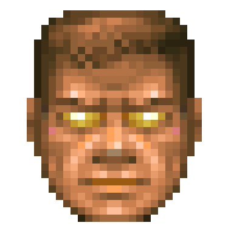

<!--  -->
<!-- <i class="fa fa-linux fa-4x"></i> -->

<!--  -->

I am a postdoctoral researcher in the field of computational fluid dynamics at the Department of Mechanics, Faculty of Applied Sciences, University of West Bohemia in Pilsen, Czech Republic. My work focuses on adaptive discontinuous Galerkin methods for time-dependent compressible flows, with emphasis on anisotropic mesh adaptation and high-order conservative solution transfer between non-matching meshes. This website provides a brief overview of my research, publications, and teaching activities.

### Research Interests

- Discontinuous Galerkin methods
- Compressible flow simulation
- Anisotropic mesh adaptation
- High-order solution transfer
- Shock-dominated transient flows

### Contact 

Ing. Tomáš Levý, Ph.D.

[Department of Mechanics](https://www.kme.zcu.cz/en/)
 
[Faculty of Applied Sciences](https://www.fav.zcu.cz/en/)
 
[University of West Bohemia](https://www.zcu.cz/en/)
 
Technická 8
 
301 00 Plzeň 3
 
Czech Republic

**Room**: UC 425 (FAV/NTIS building, 4th floor)
 
**E-mail**: [levyto@fav.zcu.cz](mailto:levyto@fav.zcu.cz)

You can also find me on:

    
    <a href="https://github.com/levyto"> 
        <i class="fa fa-github-square fa-2x" title="GitHub"></i> 
    </a>
    <a href="https://orcid.org/0000-0003-3414-868X">
        <i class="ai ai-orcid-square ai-2x" title="ORCID"></i>
    </a>
    <a href="https://www.webofscience.com/wos/author/record/55714499">
        <i class="ai ai-clarivate-square ai-2x" title="Web of Science"></i>
    </a>
    <a href="https://www.scopus.com/authid/detail.uri?authorId=58080023600">
        <i class="ai ai-scopus-square ai-2x" title="Scopus"></i>
    </a>
    <a href="https://scholar.google.com/citations?user=HlhR34MAAAAJ&hl=cs&oi=ao">
        <i class="ai ai-google-scholar-square ai-2x" title="Google Scholar"></i>
    </a>
    <a href="https://www.researchgate.net/profile/Tomas-Levy?ev=hdr_xprf">
        <i class="ai ai-researchgate-square ai-2x" title="ResearchGate"></i>
    </a>
    <a href="https://www.linkedin.com/in/tomáš-levý-143bb7129/">
        <i class="fa fa-linkedin-square fa-2x" title="LinkedIn"></i>
    </a>

---

